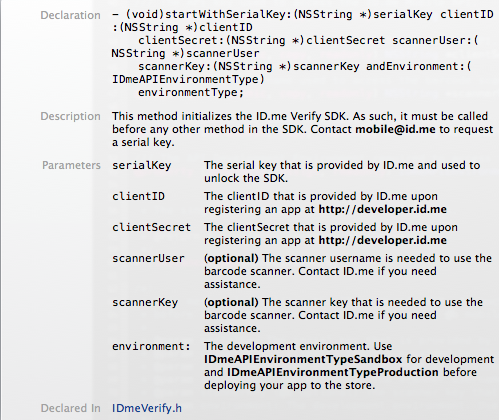
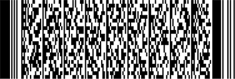

# ID.me Verify SDK (iOS)

## A. General

### Release Information
- **SDK Version:** 2.2.1 (June 25, 2014)
- **Maintained By:** [Arthur Ariel Sabintsev](http://github.com/ArtSabintsev)

For more information please email us at [mobile@id.me](mobile@id.me) or visit us at [http://developer.id.me](http://developer.id.me).

### Changelog
- Changed legal age limit from 18 to 13.
- Updated AFNetworking dependency to v2.3.1
  
### General Information
The ID.me Verify SDK for iOS is a library that adds the following functionality to your mobile iOS application:

- Scan a user's physical credential 
	- All U.S. State Licenses (incl. Washington, D.C.)
	- Common Access Cards (a.k.a. CACs)
	- Uniformed Services Cards
		- Cards held by Active Military Personnel
		- Cards held by Retired Military Personnel
		- Cards held by Family Members and Dependents of Military Personnel
- Connect to ID.me API to perform the following actions
	- Authentication 
		- Sign in
		- Sign up as military or military family member
		- Sign up as student
		- Sign up as EMT
		- Sign up as firefighter
	- Verification
		- Military or military family member
		- Student	
		- EMT
		- Firefighter
	- Profile
		- Fetch profile
		- Fetch affiliation
		- Upload user avatar/image
		- Download user avatar/image

### Sample Project
A sample project has been added to the SDK for your convenience. A few *#warning* macros have been added to notify you where you should edit the code before running the project. 

### iOS Version and iDevice Compatibility
- **iOS Compativility:** iOS 6, iOS 7
- **Device Compatibility**
	- *iPhone*: 4, 4S, 5, 5C, 5S
	- *iPad*: 3, 4, Mini
	- *iPod* Touch: 5th Gen
	
Even though iOS 6 supports the iphone 3GS and the iPad 2, the SDK does not support these devices. This is due to the lack of an auto-focusing camera lens, which is needed for the credential scanner.

### Referencing SDK Documentation within Xcode
For your convenience, *Doxygen* style comments have been added into the public headers of the SDK. If you're using Xcode 5+, simply `ALT + Left Click` on any method or variable found in the SDK to get a tooltip describing said method. An example of one of the tooltips can be found in the image below:



## B. Installation

Using CocoaPods:
```
pod 'IDmeVerify'
```

If you don't use CocoaPods, consider adding this SDK as a submodule of your application. 

Regardless which method you use, make sure to the follow the directions below.

1. Drag the **ID.me Verify SDK** file into your project. This includes the following files
	- `libIDmeVerify.a`
	- `IDmeVerify.h`
	- The `include` folder, which contains the public headers.
1. Make the following changes in the Xcode ***Project***
	- Go to your Xcode Project's Build Settings tab
	- Search for the following setting: *Architecture*
		- Change it to the following option: **Standard Architectures (armv7, armv7s)**
	- Search for the following setting: *Other Linker Flags*
		- Add two flags: **-ObjC** and **-all_load**
1. Make the following changes in the Xcode ***Target***
	- Go to your Xcode Target's *Build Settings* tab
	- Search for the following setting: *Architecture*
		- Change it to the following option: **Standard Architectures (armv7, armv7s)**
	- Search for the following setting: *Other Linker Flags*
		- Add two flags: **-ObjC** and **-all_load**
1. Import `IDmeVerify.h` in the classes that you plan
1. Added the following Apple Frameworks to your project:
	- `AVFoundation` 
	- `CFNetwork`
	- `CoreMedia` 
	- `CoreVideo` 
	- `Foundation` 
	- `UIKit`

Please make sure to include them in your project.

## C. Activiation
The SDK must be activated using 6 parameters:

To activate the SDK, simply run the following command with the provided serial-key:

 ```
- (void)startWithSerialKey:(NSString *)serialKey
                  clientID:(NSString *)clientID
              clientSecret:(NSString *)clientSecret
               scannerUser:(NSString *)scannerUser
                scannerKey:(NSString *)scannerKey
            andEnvironment:(IDmeAPIEnvironmentType)environmentType;
```

A description for all of the parameters are as follows: 

- `serialKey`: The serial key that is provided by ID.me and used to unlock the SDK.
- `clientID The` clientID that is provided by ID.me upon registering an app at @b http://developer.id.me
- `clientSecret` The clientSecret that is provided by ID.me upon registering an app at @b http://developer.id.me
- `scannerUser` (optional) The scanner username is needed to use the barcode scanner. Contact ID.me if you need assistance.
- `scannerKey` (optional) The scanner key that is needed to use the barcode scanner. Contact ID.me if you need assistance.
- `environment`: The development environment. Use @b IDmeAPIEnvironmentTypeSandbox for development and @b IDmeAPIEnvironmentTypeProduction before deploying your app to the store.
 ```

As the `IDmeVerify` class is a singleton, activation can occur at any point in time. It is our recommendation that activation occur in the `AppDelegate` during the application's startup. 

If you have a problem activating the SDK, please contact us at [mobile@id.me](mobile@id.me).

## D. Credential Scanning

### Background
The first aspect of the ID.me Verify SDK is the **Credential Scanner and Parser**. The scanner works with the following credentials:

- All U.S. State Licenses (incl. Washington, D.C.)
- Common Access Cards (a.k.a. CACs)
- Uniformed Services Cards
	- Cards held by Active Military Personnel
	- Cards held by Retired Military Personnel
	- Cards held by Family Members and Dependents of Military Personnel

The following barcode is found the above-mentioned credentials. The scanner is fine-tuned to scan this specific barcode:



The user is taught to scan this type of barcode on the first launch of the credential scanner. A help button is added to the main screen of the scanner, allowing the user to reference this information on subsequent launches of the scanner.

### Important Note on Modal Orientation
The credential scanner portion of the SDK works in lanscape mode. Please make sure your app has landscape orientation enabled.

### Execution
The credential scanner is presented as a modal view controller. Once a credential is scanned, it is parsed in the background and data is returned in an Objective-C block. 

The scanner is activated with the following method:

```
- (void)scanCredentialInViewController:(UIViewController *)externalViewController
                    forCredentialTypes:(IDmeVerifyDetectCredentialTypes)credentialTypes
                           withResults:(IDmeVerifyScanResults)scanResults;
```
The params in this method are as follows:

- `externalViewController` The viewController which will present the credential scanner model viewController.
- `*credentialTypes` One or more credential types defined in the IDmeVerifyDetectCredentialTypes options enumerator.
	- For example: If you want to only scan US State Licenses and Common Access Cards, use the following flags: `IDmeVerifyDetectCredentialTypeStateLicense | IDmeVerifyDetectCredentialTypeCommonAccessCard`
- `scanResults` An Objective-C block that returns the parsed results of the scanned credential and an NSError object.

The scanner should be implemented in the following manner:

```
    [[IDmeVerify sharedInstance] scanCredentialInViewController:self
                                             forCredentialTypes:<IDmeVerifyDetectCredentialType Option>
                                                    withResults:^(IDmeCredential *credential, NSError *error) {
        
											             if (error) { // Error
											        
											             } else { // Credential was scanned and parsed successfully
											        
											             }
    }]; 

```

If there are no errors, the following snippet of code may be helpful in your `else` statement:

```
 switch ([credential credentialType]) {
          
     case IDmeVerifyCredentialTypeStateLicense:{
         IDmeStateLicense *stateLicense = (IDmeStateLicense *)credential;
         // Extract data from stateLicense
     	 } break;
         
     case IDmeVerifyCredentialTypeCommonAccessCard:{
         IDmeCommonAccessCard *commonAccessCard = (IDmeCommonAccessCard *)credential;
         // Extract data from commonAccessCard
    	 } break;
         
     case IDmeVerifyCredentialTypeUniformedServicesCard:{
         IDmeUniformedServicesCard *uniformedServicesCard = (IDmeUniformedServicesCard *)credential;
         // Extract data from uniformedServicesCard
     	 } break;
     
     case IDmeVerifyCredentialTypeUniformedServicesDependentCard:{
         IDmeUniformedServicesDependentCard *uniformedServicesDependentCard = (IDmeUniformedServicesDependentCard *)credential;
         // Extract data from uniformedServicesDependentCard
    	 } break;
    
     case IDmeVerifyCredentialTypeUnknown:{
         // Occurs when scanned credential is unknown
         // An error is also thrown, so this conditional should never be entered if you use the if-else block in the aformenetioned code snippet.
     } break;
 }
```

All potential errors that could occur are explained at a later step in this section.

### Credentials

#### Hierarchy
The data returned in the Objective-C block in the aforementioned method are all instances or subclassed instances of the `IDmeCredential` class. The headers for this class, and its subclasses are made public in this library. For your reference, the class hierarchy is as follows:

- `IDmeCredential`
	- `IDmeStateLicense` subclasses `IDmeCredential` 
	- `IDmeDefenseCredential` subclasses `IDmeCredential`
		- `IDmeCommonAccessCard` subclasses `IDmeDefenseCredential`
		- `IDmeUniformedServicesCard` subclasses `IDmeDefenseCredential`
			- `IDmeUniformedServicesDependentCard` subclasses `IDmeUniformedServicesCard`

#### Parsed Data		
For easy reference, each IDmeCredential instance (and subclassed instance) is made to respond to an overwritten instance of the `description` method, which returns back all the stored data in the `IDmeCredential` class of interest. 

For example, let's assume we have an object named `stateLicense`, (e.g., `IDmeStateLicense *stateLicense;`).  When calling `[stateLicense description]`, the following ***key : value*** result wil be outputted:

```
==[PARSED DATA]==
Credential Type : US State License 
firstName : JOHN 
lastName : SMITH 
address : 123 MAIN ST 
city : WILMINGTON 
state : DE 
zipCode : 19801 
birthdate : 02/01/1970 
birthMonth : 01  
birthDay : 02 
birthYear : 1970 
age : 43 years old
```
Each key in the list above is also the the name of a property on the `IDmeStateLicense` object that can be used to extract the data/values on the right side of the colon. 
To reiterate, each `IDmeCredential` subclass instance has their own set of properties. The easiest way of finding our what those properties are, is by accessing the `description` method. Another way of finding out this informaiton is by checking the header files in the *Classes* folder of the SDK for each `IDmeCredential` subclass and traversing the class hierarchy for the properties that are inherited.

### Error Handling
There are fives potential outcomes during the credential scanning and parsing process. Four of these outcomes are errors. All of the errors are returned in the `IDmeVerifyScanResults` block, which is the last parameter in credential scanner method described above. Each error will return a non-nil NSError object, and a nil Credential object. The four verification related errors can be found in the `IDmeVerifyErrorCode` typedef, which deals with all errors in the SDK. The four scanning and parsing related errors are as follows:

- `IDmeVerifyErrorCodeScannerAccessForbidden`
	- Error occurs if developer attempts to access scanner, but is not given access to it. To gain access to scanner, send an email to [mobile@id.me](mobile@id.me).
- `IDmeVerifyErrorCodeNoScanPerformed`
	- Error occurs if user exits scanner without scanning a credential.
- `IDmeVerifyErrorCodeCouldNotParseCredential`
	- Error occurs if scanned credential could not be parsed.
- `IDmeVerifyErrorCodeCredentialOwnerIsUnderLegalAge`
	- Error occurs if owner of scanned credential is under age (e.g., under 13). 

### Known Exceptions
- **Illinois**: Licenses from this state only encode the first-name, last-name and birthdate on the barcode.
- **Iowa**: License may not scan properly. We are working to address this issue.
- **North Dakota**: License may not scan properly. We are working to address this issue.
- **South Dakota**: License may not scan properly. We are working to address this issue.
- **Vermont**: License may not scan properly. We are working to address this issue.

### Internet Connectivity
Credential scanning occurs client-side (e.g. on the iDevice), therefore, internet connectivity is not required.

## E. Interfacing with our API
Connecting to the API is achieved using the following instance method on the `IDmeAPIMediator` object:

```
- (void)performRequest:(IDmeAPIRequestType)requestType
            withParams:(NSMutableDictionary *)params
            andResults:(IDmeAPIRequestResults)requestResults;
```

The method ingests two parameters and returns the results in the `IDmeAPIRequestResults` block, which is defined as:

```
typedef void (^IDmeAPIRequestResults)(BOOL status, NSString *errorMessage, id resultsObject);
```

For an entire list of the API requests and how to use them. please refer to the sample project included with these SDKs. Xcode `#warning` statements have been added to notify you where you should edit the code before running the project.

## F. Convenience Macros and Constants
The following macros and constants were made public in the SDK for your convenience:

- `IDmeLog(fmt, …)`:This is an NSLog that prefixes every statement with **[ID.me Verify]:**, which can be used for debugging SDK related errors when you implement the SDK into your project.
- `IDME_VERIFY_ERROR_DOMAIN`: All NSError objects in this SDK utilize this Error Domain.
- `kIDmeVerifySDKVersion`: An NSString constant that yields the current version of the SDK.

## G. Terms of Use
By using this SDK, you agree to [ID.me's Terms of Use](https://www.id.me/partner-terms).
